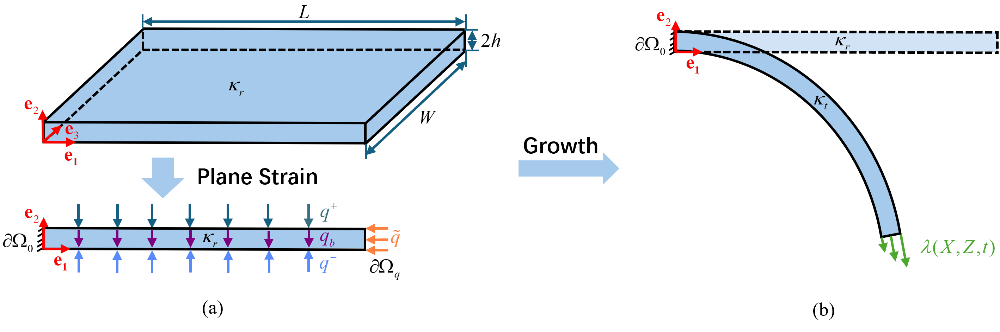
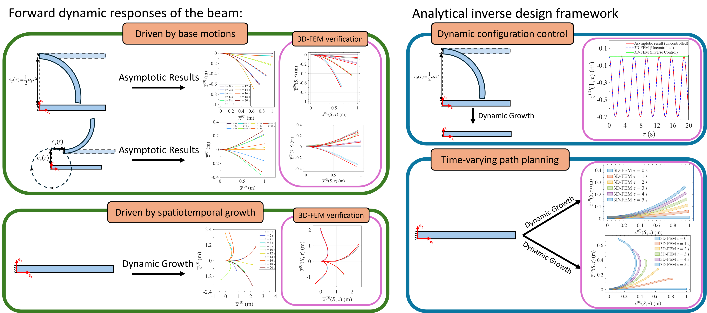

# Vibrations and Inverse Shape Programming of Hyperelastic Beams Driven by Dynamic Growth

Supplementary equation notebook, MATLAB solver, movie, and illustrations for the manuscript by Jiale Wei, Jiong Wang, and Zhanfeng Li.

## Overview

The paper develops a dynamic finite-strain beam theory by applying a plane-strain assumption and thickness reduction to a three-dimensional incompressible hyperelastic continuum. The forward model describes nonlinear bending and vibration under base motion and prescribed growth fields. The beam reduction and numerical examples use the fixed-mass active-strain interpretation of the growth tensor.

An analytical inverse construction determines the longitudinal growth coefficients from a prescribed, kinematically compatible bottom-surface evolution path, including the inertial contribution. The examples demonstrate compensation of base-motion-induced bending and continuous shape programming.

## Supplementary files

| File | Contents |
| --- | --- |
| [Key_Equations.nb](Key_Equations.nb) | Mathematica notebook containing the complete key equations, organized by section headings and short explanations before each equation block. It covers thickness recurrence relations, beam balances, averaged stress, the reduced rotation equation, and the inverse growth coefficients. |
| [solve.m](solve.m) | MATLAB function for the forward dynamic problem, using spatial finite differences and adaptive implicit time integration. |
| [Video.mp4](Video.mp4) | Supplementary Movie 1 showing dynamic responses and shape-programming examples. Use **View raw** on the file page to view or download the video. |
| [theory.png](theory.png) | Illustration of the theoretical formulation. |
| [Results.png](Results.png) | Illustration of the inverse shape-programming results. |

The notebook presents the complete expressions used at the key stages of the formulation, with explanatory text. Intermediate symbolic simplification commands and trial calculations are omitted.

## Running the MATLAB solver

Download the repository and set its folder as the MATLAB current folder. The default symbolic input definitions require **Symbolic Math Toolbox**. Run:

```matlab
R = solve();
```

The default example uses a smoothly started periodic base motion, with longitudinal growth coefficients `Nl10 = 1`, `Nl11 = 0`, and `Nl12 = 0`. Its default settings are `h0 = 0.01`, `epsilon = 0.001`, `nGrid = 500`, and `Tmax = 20`. Coordinates and time in the solver are nondimensional.

To specify another base motion or growth field, edit the five expressions `cx_sym`, `cz_sym`, `Nl10_sym`, `Nl11_sym`, and `Nl12_sym` in `user_symbolic_fields` inside [solve.m](solve.m). Their required derivatives are generated automatically.

Alternatively, supply the complete numerical function-handle structure through the `F` option, following the fields listed in `validate_fields`. This route does not require Symbolic Math Toolbox.

Solver and output settings can be passed in a structure. For example:

```matlab
R = solve(struct('Tmax', 5, 'PlotResults', false, 'WriteFiles', false));
```

The solver uses a cell-centred Green kernel and ghost-point finite differences in space, and MATLAB's `ode15i` for adaptive integration of the implicit equations.

The returned structure `R` contains the sampled time, position and rotation fields, stretch quantities, and solver diagnostics. By default, the program also plots the results and creates an output folder containing free-end displacement data, selected shape profiles, and a shape image. Video export is enabled with `MakeVideo = true`.

## Theory and shape programming

The reduced formulation retains thickness contributions through $h_0^2$ and the leading inertial contribution associated with $\varepsilon$. The equation notebook provides the complete expressions for the successive stages of the reduction.



The analytical inverse construction reconstructs the thickness-independent longitudinal growth coefficient and its first thickness coefficient. Together, they define the linear through-thickness growth field used to produce the prescribed evolution.

The demonstrated applications include:

- Open-loop compensation of bending induced by accelerated and periodic base motions.
- Continuous evolution toward prescribed beam configurations.



## Finite element comparison

The manuscript compares the reduced-model predictions with three-dimensional nonlinear finite element simulations in COMSOL Multiphysics. The finite element model uses an incompressible neo-Hookean material, second-order tetrahedral elements, and plane-strain constraints.

The comparisons and parameter studies assess the accuracy of the dynamic beam model and the analytical inverse construction.

## Citation

For the current manuscript, please use:

```bibtex
@unpublished{WeiDynamicGrowthBeam,
  author = {Wei, Jiale and Wang, Jiong and Li, Zhanfeng},
  title = {Vibrations and Inverse Shape Programming of Hyperelastic Beams Driven by Dynamic Growth},
  note = {Manuscript}
}
```
